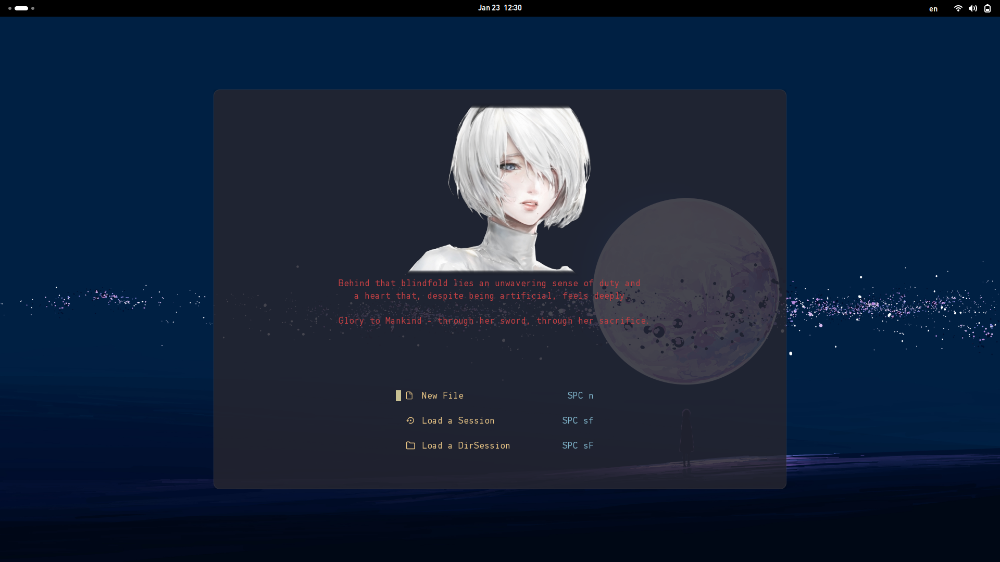
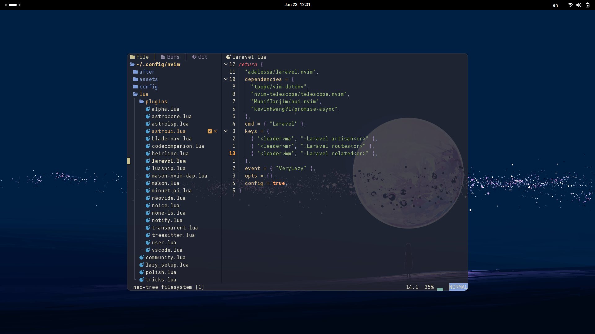

# Neorora: AstroNvim Configuration

This is my personal AstroNvim configuration, Neorora, meticulously crafted for an enhanced coding experience in **Python**, **PHP** (with a focus on **WordPress** and **Laravel**), **Rust**, and **Web Development** (HTML, CSS, JavaScript, TypeScript). It's designed to be both functional and visually appealing.

{ width=45% float-left margin-right=10px }
{ width=45% float-left }

## ✨ Features

- **Comprehensive Language Support:**
  - **LSP:** Pre-Installed Language Servers support for intelligent code completion, diagnostics, and go-to-definition.
  - **Formatting:** Automatic code formatting on save to maintain a consistent style.
  - **Syntax Highlighting:** Enhanced syntax highlighting with Tree-sitter for numerous languages.
  - **Diagnostics:** Real-time error checking and linting to catch issues as you type.
- **Specialized Tooling:**
  - **PHP & Laravel:** Includes Intelephense for advanced PHP features, Blade LSP for Laravel's templating, and dedicated plugins for Laravel development (`adalessa/laravel.nvim`, `ricardoramirezr/blade-nav.nvim`).
  - **Rust:** Equipped with `rust-analyzer` for a smooth Rust development experience.
  - **Python:** Configured with `basedpyright` and venv support for organized Python projects.
  - **Web Development:** Complete support for HTML, CSS, JavaScript, and TypeScript with corresponding LSPs and formatters.
- **AI Assistance:** Integrated `olimorris/codecompanion.nvim` and `milanglacier/minuet-ai.nvim` for intelligent code completion and refactoring powered by Large Language Models like Qwen and Gemini, leveraging platforms like DeepInfra and Google AI.
- **Enhanced UI:**
  - **Noice.nvim:** A visually engaging command-line interface using `folke/noice.nvim`.
  - **Kanagawa Theme:** A beautiful, modern colorscheme, with customized highlight groups for improved visibility (`rebelot/kanagawa.nvim`). Alternatives are also available: `rose-pine/neovim`, `lunarvim/horizon.nvim`, `olivercederborg/poimandres.nvim`
  - **Transparency:** Configurable transparency for a sleek look (`xiyaowong/transparent.nvim`).
  - **Image.nvim:** Displaying the captivating 2B anime character from NieR: Automata on the Alpha dashboard, but only if you're using a terminal that supports graphics protocols like the Kitty terminal (`3rd/image.nvim`). Like kitty, ghostty or konsole.
- **All the AstroNvim Goodies:** Leverages all the powerful features that come with [AstroNvim](https://astronvim.com/).
- **Customizations:**
  - **Neovide:** For Neovide users, specific options are set to enhance the GUI experience. Although you will lose 2B on alpha dashboard so it doesn't worth it. :(
  - **Custom Filetypes:** Support added for `.mq5`, `.blade.php`, `hyprlang` and `jsonc` syntax highlighting.
  - **Custom Snippets:** Snippets for Blade files.
  - **Database Integration:** Includes `vim-dadbod` and `vim-dadbod-ui` for easy database interactions, with `vim-dadbod-completion` for SQL autocompletion.

## 📦 Plugins (Newly Added and Notable Mentions)

Here's a breakdown of some of the key plugins, including those that were not mentioned in the original README:

| Plugin                                 | Description                                                                                                                                                                                                                  |
| -------------------------------------- | ---------------------------------------------------------------------------------------------------------------------------------------------------------------------------------------------------------------------------- |
| `olimorris/codecompanion.nvim`         | **AI Code Assistant:** Leverages LLMs (Qwen, Gemini, ...) for code generation, chat, and diffing capabilities. It also enables you to extend other AI model adapters.                                                        |
| `milanglacier/minuet-ai.nvim`          | **AI Code Completion:** Offers AI-powered code completion.                                                                                                                                                                   |
| `ricardoramirezr/blade-nav.nvim`       | **Blade Navigation:** Provides smart autocompletion for Laravel Blade components and tags.                                                                                                                                   |
| `3rd/image.nvim`                       | **Image Display:** Displays images in the buffer (requires Kitty or Ghostty terminal).                                                                                                                                       |
| `xiyaowong/transparent.nvim`           | **Transparency:** Allows you to make whole UI elements transparent.                                                                                                                                                          |
| `adalessa/laravel.nvim`                | **Laravel Development:** Streamlines Laravel development with commands for routes, artisan, and more.                                                                                                                        |
| `kristijanhusak/vim-dadbod-ui`         | **Database UI:** A user-friendly interface for interacting with databases.                                                                                                                                                   |
| `kristijanhusak/vim-dadbod-completion` | **Database Completion:** Provides intelligent autocompletion for SQL queries.                                                                                                                                                |
| `linux-cultist/venv-selector.nvim`     | **Python Virtual Environment Selector:** Allows quick switching between Python virtual environments.                                                                                                                         |
| `EmranMR/tree-sitter-blade`            | **Tree-sitter parser for Blade:** Enables improved syntax highlighting and other Tree-sitter features for Blade templates. It is defined in `./lua/plugins/treesitter.lua`, the queries are saved in `./after/queries/blade` |
| `jay-babu/mason-nvim-dap.nvim`         | \*\*Install and setup debuggers for Python, PHP (xDebug), and Rust. Also, it includes a section to configure the usage of the selected virtual environment in venv-selector for debugging.                                   |

## 🛠️ Installation

### Prerequisites

1. **Backup Existing Neovim Configuration (Recommended):**

   ```bash
   mv ~/.config/nvim ~/.config/nvim.bak
   mv ~/.local/share/nvim ~/.local/share/nvim.bak
   mv ~/.local/state/nvim ~/.local/state/nvim.bak
   mv ~/.cache/nvim ~/.cache/nvim.bak
   ```

2. **Fork or Clone:**

   - **Fork (Recommended):** Click the "Fork" button on the top right of this repository page to create your own copy. This allows you to track your changes.
   - **Clone (Alternative):** If you don't need to track changes through GitHub, you can clone directly.

3. **Install Dependencies:**

   These are the dependencies based on the provided configuration. You might need to adjust these based on the features you intend to use.

   **Fedora Linux (using `dnf`):**

   ```bash
   # Neovim, Git, Node.js, npm
   sudo dnf install -y neovim git nodejs npm
   # PHP, Composer, required PHP extensions
   sudo dnf install -y php php-cli php-common php-mbstring php-xml php-zip composer
   # Build tools (compiler, linker, etc.)
   sudo dnf install -y make cmake gcc gcc-c++
   # Rust
   sudo dnf install -y rustup
   # Python and other development packages
   sudo dnf install -y python3 python3-pip

   # Required for rust development
   rustup-init
   rustup component add rustfmt

   # Required for Python debugging
   pip install debugpy

   # (Optional) Required by image.nvim
   sudo dnf install -y ImageMagick ImageMagick-devel luarocks
   luarocks --local --lua-version=5.1 install magick
   ```

   **Other Distributions:** Adapt the above commands using your distribution's package manager (e.g., `apt` for Debian/Ubuntu, `pacman` for Arch Linux).

4. **Clone Your Fork (or the Repository):**

   ```bash
   # If you forked:
   git clone https://github.com/<your_username>/<your_fork_name>.git ~/.config/nvim

   # If you cloned directly:
   git clone https://github.com/taiwbi/neorora.git ~/.config/nvim
   ```

### Launch Neovim

Open Neovim, and AstroNvim will automatically install and configure the plugins using `lazy.nvim`:

```bash
nvim
```

You should see a welcome screen (Alpha dashboard) with the 2B image (if you're using Kitty or Ghostty) or the ASCII art.

## 🚀 Post-Installation

1. **Intelephense License (Optional):**

   - If you have an Intelephense license, add it to `lua/plugins/astrolsp.lua` in the `intelephense` section:
     ```lua
     init_options = {
       licenceKey = "YOUR_LICENSE_KEY_HERE",
     },
     ```

2. **Configure AI Tools:**

   - Refer to the documentation of `codecompanion.nvim` and `minuet-ai.nvim` for any necessary API key setup or configuration.
   - Currently, the config uses DeepInfra endpoints and requires a `DEEPINFRA_API_KEY` env variable. You can put this key in a file at `~/.ssh/keys/deepinfa-key`. You need both.

3. **Explore and Customize:**
   - Familiarize yourself with AstroNvim's mappings and commands. Use `:help` to access documentation.
   - Customize further by editing the files in `lua/plugins/`.

## 🤝 Contributing

Feel free to open issues or pull requests if you have suggestions, improvements, or bug fixes. I really haven't got the time to test the installation process, it should work but still might not! If you encounter any issues during the setup or have any questions, feel free to ask in [GitHub Issues](https://github.com/taiwbi/Neorora/issues).

## 🎉 Enjoy!

Happy coding with your new and improved AstroNvim setup!
